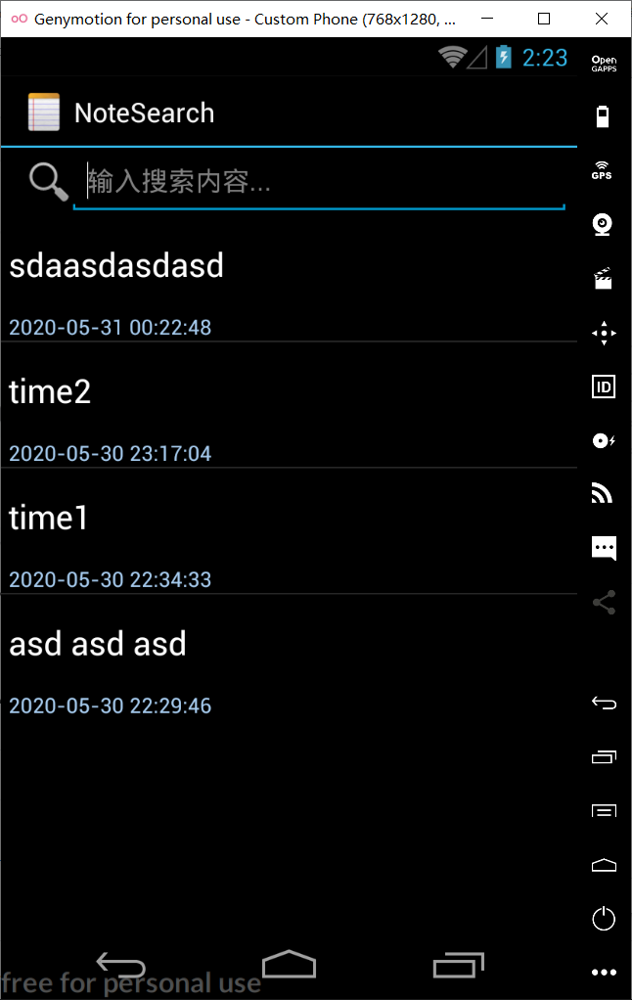
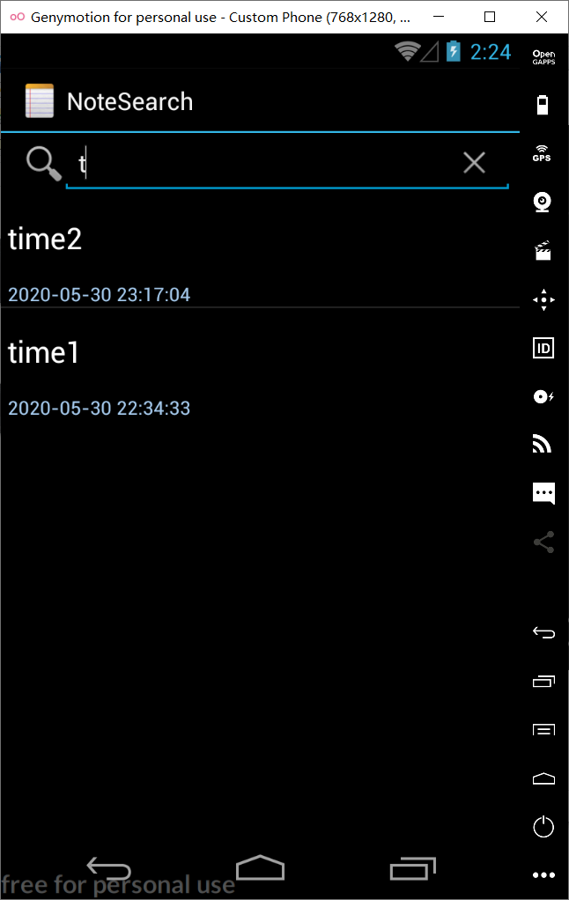
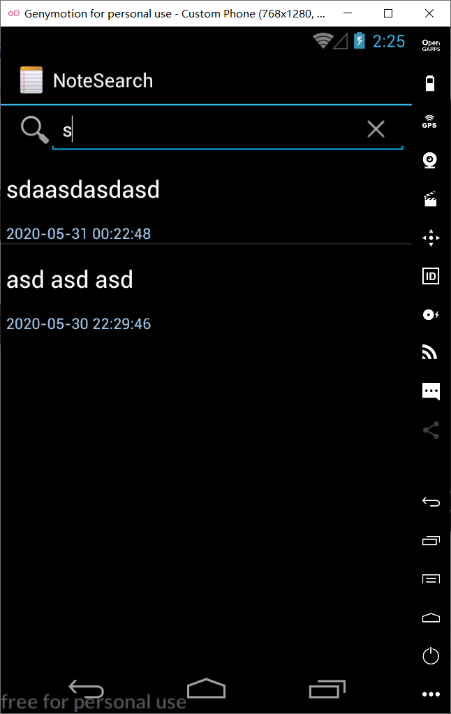
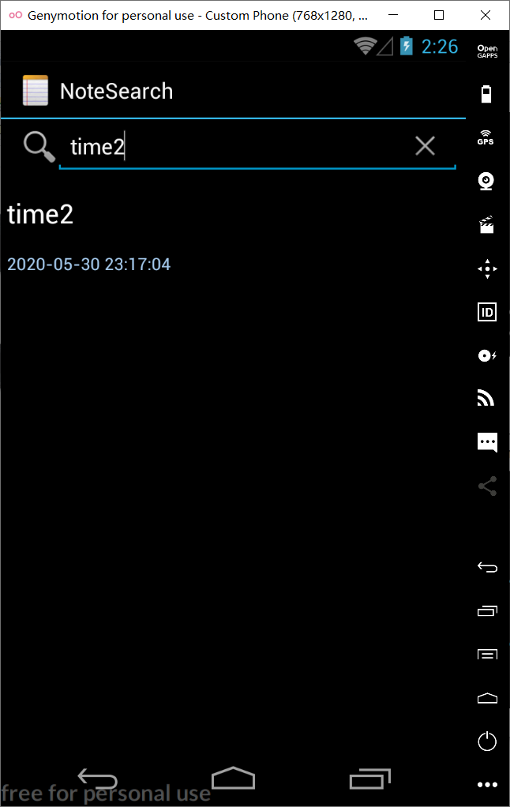

# NotePad

This is an AndroidStudio rebuild of google SDK sample NotePad 期中实验 基于NotePad应用做功能扩展

# 1、NoteList中显示条目增加时间戳显示

修改noteslists_items.xml，增加时间戳的Textview

```
<!--添加一个垂直的线性布局-->
<LinearLayout xmlns:android="http://schemas.android.com/apk/res/android"
    android:id="@+id/layout"
    android:layout_width="match_parent"
    android:layout_height="match_parent"
    android:orientation="vertical">

    <!-- 原TextView -->
    <TextView xmlns:android="http://schemas.android.com/apk/res/android"
        android:id="@android:id/text1"
        android:layout_width="match_parent"
        android:layout_height="?android:attr/listPreferredItemHeight"
        android:textAppearance="?android:attr/textAppearanceLarge"
        android:gravity="center_vertical"
        android:paddingLeft="5dip"
        android:textColor="@color/colorWhite"
        android:singleLine="true" />

    <!-- 时间戳TextView -->
    <TextView
        android:id="@+id/text_time"
        android:layout_width="match_parent"
        android:layout_height="wrap_content"
        android:textAppearance="?android:attr/textAppearanceSmall"
        android:paddingLeft="5dip"
        android:textColor="@color/colorBlue" />

</LinearLayout>
```

修改NoteEditor.java，在updateNode()函数中，添加更改 values的值,

```
 Date nowTime = new Date(System.currentTimeMillis());
        SimpleDateFormat sdFormatter = new SimpleDateFormat("yyyy-MM-dd HH:mm:ss");
        String retStrFormatNowDate = sdFormatter.format(nowTime);
        ContentValues values = new ContentValues();
        values.put(NotePad.Notes.COLUMN_NAME_MODIFICATION_DATE,retStrFormatNowDate);
```

修改NoteList中PROJECTION和dataColumns，viewIDs的值，使得时间戳可以显示出来

```
//显示时间
String[] dataColumns = {NotePad.Notes.COLUMN_NAME_TITLE,NotePad.Notes.COLUMN_NAME_MODIFICATION_DATE  };
int[] viewIDs = {android.R.id.text1, R.id.text_time};
```

运行效果如图所示：


## 添加笔记查询功能（根据标题查询）

找到菜单的xml文件，list_options_menu.xml，添加一个搜索的item，搜索图标用安卓自带的图标，设为总是显示

```
<!--搜索-->
    <item
        android:id="@+id/menu_search"
        android:title="@string/menu_search"
        android:icon="@android:drawable/ic_search_category_default"
        android:showAsAction="always">
    </item>
```

在NoteList中找到onOptionsItemSelected方法，在switch中添加搜索的case语句

```

case R.id.menu_search:
startActivity(new Intent(Intent.ACTION_SEARCH,getIntent().getData()));
return true;
```

先布局搜索页面，在layout中新建布局文件note_search_list.xml

```
<?xml version="1.0" encoding="utf-8"?>
<LinearLayout xmlns:android="http://schemas.android.com/apk/res/android"
    android:orientation="vertical"
    android:layout_width="match_parent"
    android:layout_height="match_parent">

    <SearchView
        android:layout_width="match_parent"
        android:layout_height="wrap_content"
        android:id="@+id/search_view"
        android:iconifiedByDefault="false"
        android:queryHint="输入搜索内容..."
        android:layout_alignParentTop="true">
    </SearchView>

    <ListView
        android:layout_width="match_parent"
        android:layout_height="wrap_content"
        android:id="@android:id/list">
    </ListView>

</LinearLayout>
```

要动态地显示搜索结果，就要对SearchView文本变化设置监听，NoteSearch除了要继承ListView外还要实现SearchView.onQueryTextListener接口

```
package com.example.android.notepad;

import android.app.ListActivity;
import android.content.ContentUris;
import android.content.Intent;
import android.database.Cursor;
import android.net.Uri;
import android.os.Bundle;
import android.view.View;
import android.widget.ListView;
import android.widget.SearchView;
import android.widget.SimpleCursorAdapter;

public class NoteSearch extends ListActivity implements SearchView.OnQueryTextListener {
    private static final String[] PROJECTION = new String[] {
            NotePad.Notes._ID, // 0
            NotePad.Notes.COLUMN_NAME_TITLE, // 1

            NotePad.Notes.COLUMN_NAME_MODIFICATION_DATE //加入了修改时间的显示

    };

    @Override
    protected void onCreate(Bundle savedInstanceState) {
        super.onCreate(savedInstanceState);
        setContentView(R.layout.note_search_list);
        //获取intent
        Intent intent = getIntent();
        if (intent.getData()==null){
            intent.setData(NotePad.Notes.CONTENT_URI);
        }

        getListView().setOnCreateContextMenuListener(this);

        SearchView searchview = (SearchView)findViewById(R.id.search_view);

        searchview.setOnQueryTextListener(NoteSearch.this);

    }
    /** 实现相应的接口 **/
    @Override
    public boolean onQueryTextSubmit(String query) {
        return false;
    }
    @Override
    public boolean onQueryTextChange(String newText) {
        String selection = NotePad.Notes.COLUMN_NAME_TITLE + " Like ? ";//查询条件
        String[] selectionArgs = { "%"+newText+"%" };////查询条件参数，配合selection参数使用,%通配多个字符
        Cursor cursor = managedQuery(
                getIntent().getData(),             // 用于ContentProvider查询的URI，从这个URI获取数据
                PROJECTION,                       // 用于标识uri中有哪些columns需要包含在返回的Cursor对象中
                selection,                        // 作为查询的过滤参数
                selectionArgs,                     // 查询条件参数，配合selection参数使用
                NotePad.Notes.DEFAULT_SORT_ORDER  // 排序
        );
        //适配器，将游标中的数据映射到布局文件中的TextView控件或者ImageView控件中
        String[] dataColumns = { NotePad.Notes.COLUMN_NAME_TITLE ,  NotePad.Notes.COLUMN_NAME_MODIFICATION_DATE };
        int[] viewIDs = { android.R.id.text1 , R.id.text_time };
        SimpleCursorAdapter adapter = new SimpleCursorAdapter(
                this,
                R.layout.noteslist_item,  //布局文件
                cursor,
                dataColumns,
                viewIDs
        );
        setListAdapter(adapter);
        return true;
    }
    @Override
    protected void onListItemClick(ListView l, View v, int position, long id) {
        // Constructs a new URI from the incoming URI and the row ID
        Uri uri = ContentUris.withAppendedId(getIntent().getData(), id);
        // Gets the action from the incoming Intent
        String action = getIntent().getAction();
        // Handles requests for note data
        if (Intent.ACTION_PICK.equals(action) || Intent.ACTION_GET_CONTENT.equals(action)) {
            // Sets the result to return to the component that called this Activity. The
            // result contains the new URI
            setResult(RESULT_OK, new Intent().setData(uri));
        } else {
            // Sends out an Intent to start an Activity that can handle ACTION_EDIT. The
            // Intent's data is the note ID URI. The effect is to call NoteEdit.
            startActivity(new Intent(Intent.ACTION_EDIT, uri));
        }
    }
}
```

最后要在AndroidManifest.xml添加搜索activity

```
<!--添加搜索activity-->
        <activity
            android:name=".NoteSearch"
            android:label="NoteSearch"
            >

            <intent-filter>
                <action android:name="android.intent.action.NoteSearch" />
                <action android:name="android.intent.action.SEARCH" />
                <action android:name="android.intent.action.SEARCH_LONG_PRESS" />
                <category android:name="android.intent.category.DEFAULT" />
                <data android:mimeType="vnd.android.cursor.dir/vnd.google.note" />
                <!--1.vnd.android.cursor.dir代表返回结果为多列数据-->
                <!--2.vnd.android.cursor.item 代表返回结果为单列数据-->
            </intent-filter>
        </activity>
```


### 最终效果图









