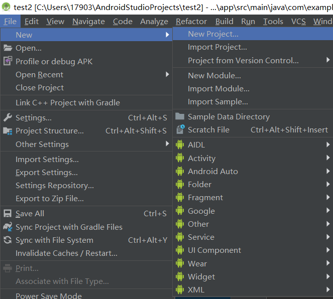
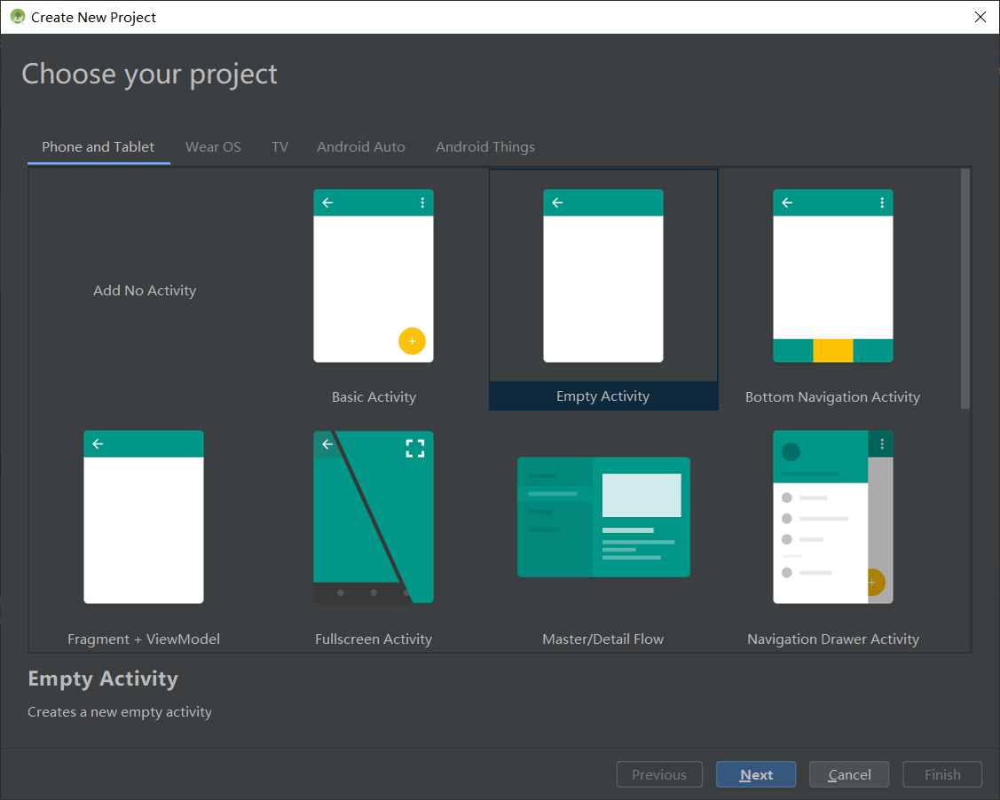
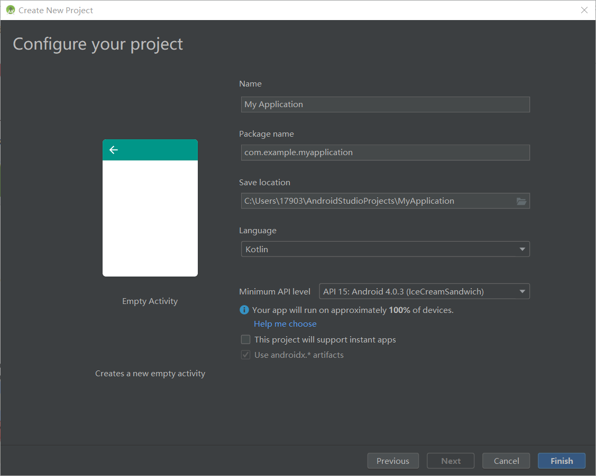
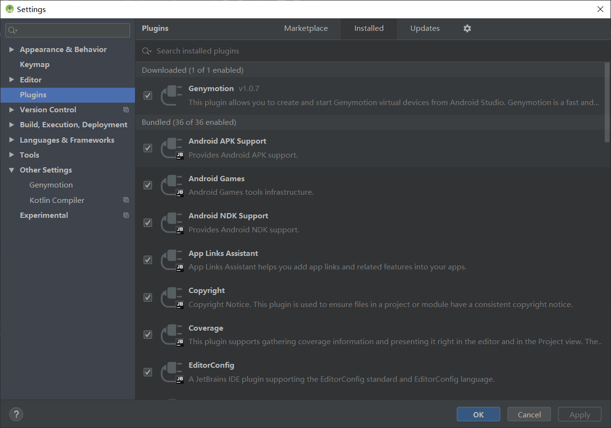
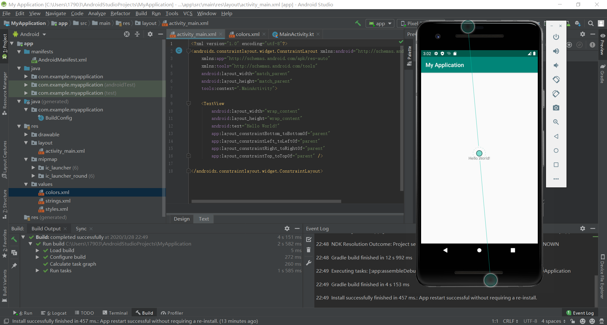
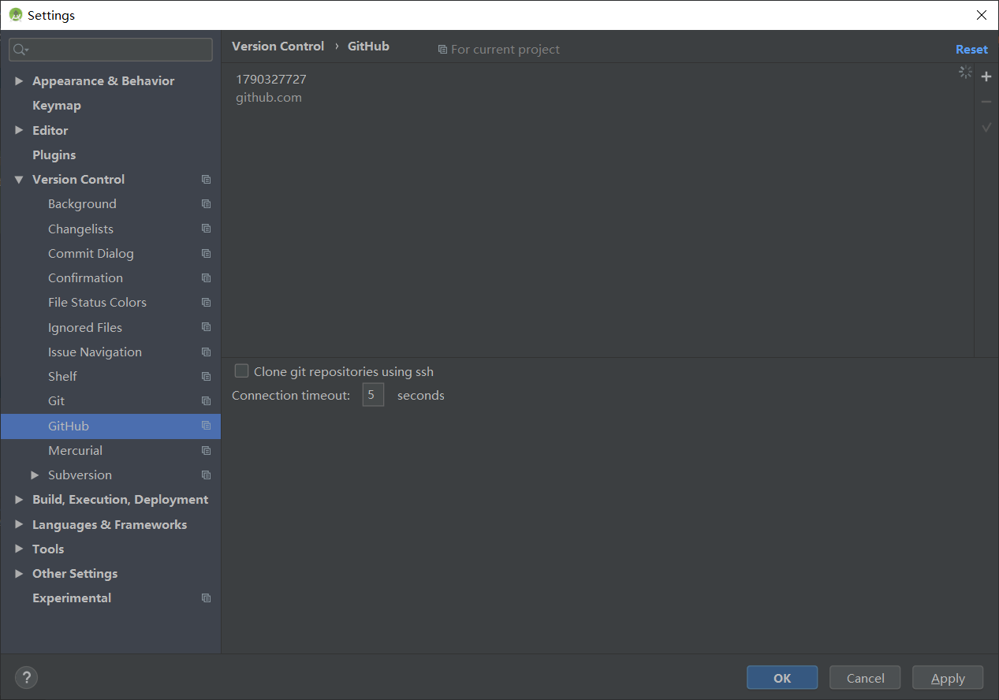
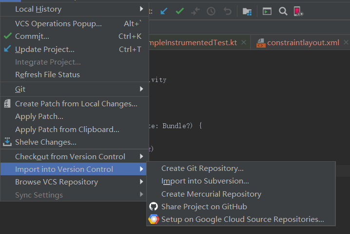

# Android开发实验基础

## 实验条件

1.Android studio3.5

2.Git

## 实验步骤

### 创建一个新工程

点击左上角File->New->New project

选择需要的样式，我这里选择Empty Activity

点击Next，填写工程的信息

点击Finish完成

## 创建与Genymotion的链接

打开setting从Plugins中搜索Genymotion安装

安装完成重启Android studio工具栏出现

则安装成功

运行项目

### 同步到github

点击左上角File->Settings... ，在Version Control中

设置Github

点击VCS

