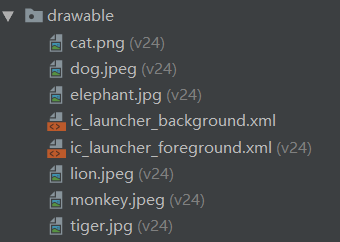
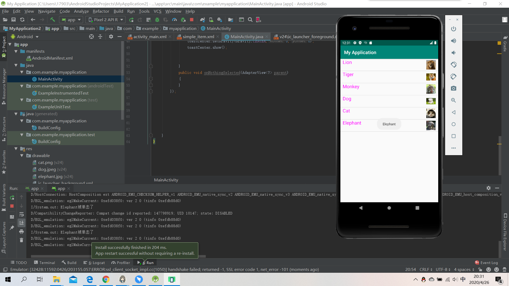
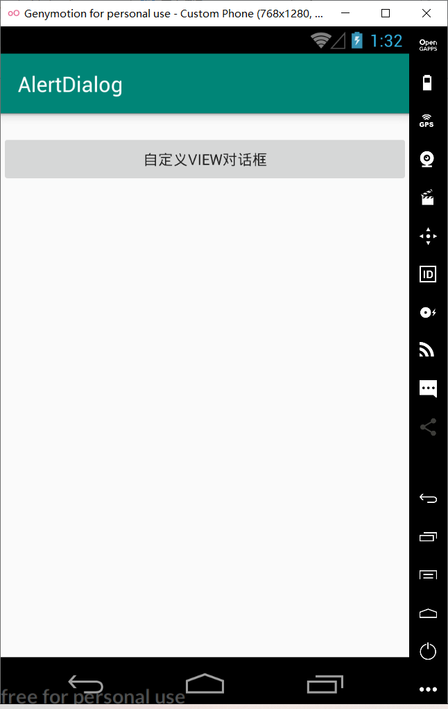
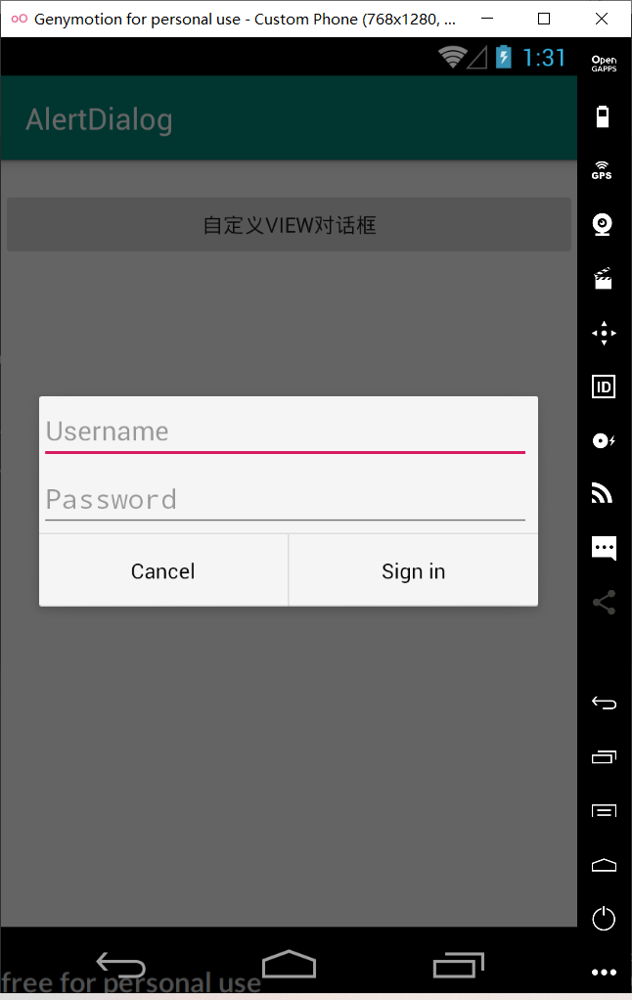
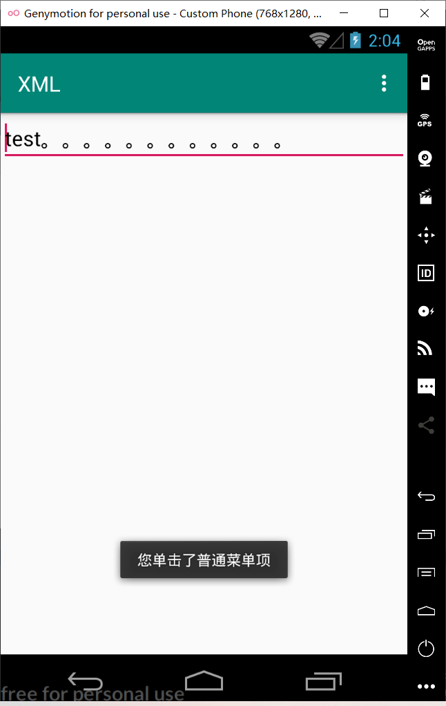
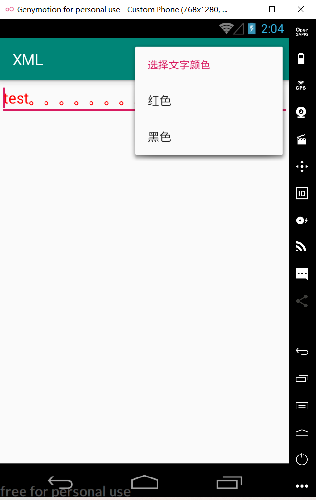
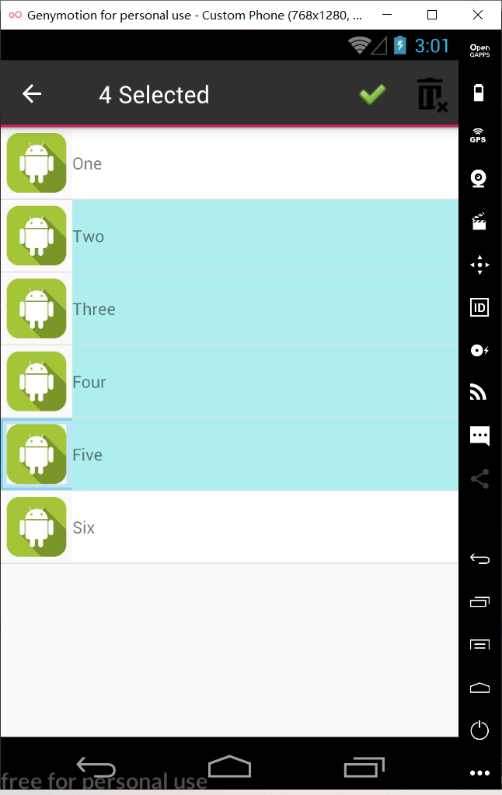

# 实验三 ：Android UI 组件

## 一： Android ListView 的用法

#### **activity_main.xml**

```
<?xml version="1.0" encoding="utf-8"?>
<androidx.constraintlayout.widget.ConstraintLayout xmlns:android="http://schemas.android.com/apk/res/android"
    android:orientation="horizontal"
    android:layout_width="match_parent"
    android:layout_height="match_parent">
<!--定义一个listview -->
    <ListView
        android:id="@+id/mylist"
        android:layout_width="match_parent"
        android:layout_height="match_parent" />
</androidx.constraintlayout.widget.ConstraintLayout>
```

#### activity_item.xml

```
<?xml version="1.0" encoding="utf-8"?>
<LinearLayout xmlns:android="http://schemas.android.com/apk/res/android"
android:orientation="horizontal"
android:layout_width="match_parent"
android:layout_height="match_parent">
<!--总的布局是横向的  -->
<!--定义一个imageview，作为列表项的一部分  图片位于右边 -->
<!--再定义一个textview ,用于作为列表项的一部分 -->
  <TextView android:id="@+id/name"
      android:layout_width="wrap_content"
      android:layout_height="wrap_content"
      android:layout_weight="1"
      android:paddingLeft="10dp"
      android:textColor="#f0f"
      android:textSize="20sp"/>

<ImageView android:id="@+id/header"
    android:layout_width="50dp"
    android:layout_height="50dp"
    android:layout_gravity="right"
    android:paddingRight="10dp"/>
      </LinearLayout>
```

#### MainActivity.java

```
package com.example.myapplication;

import androidx.appcompat.app.AppCompatActivity;
import android.os.Bundle;
import android.util.Log;
import android.view.Gravity;
import android.view.View;
import android.widget.AdapterView;
import android.widget.ListView;
import android.widget.SimpleAdapter;
import android.widget.Toast;
import java.util.ArrayList;
import java.util.HashMap;
import java.util.List;
import java.util.Map;


public class MainActivity extends AppCompatActivity {
    private String[] names = new String[]
            {"Lion","Tiger","Monkey","Dog","Cat","Elephant"};
    private int[] ImageIds = new int[]{R.drawable.lion,R.drawable.tiger,
            R.drawable.monkey, R.drawable.dog,R.drawable.cat,R.drawable.elephant};
    @Override
    protected void onCreate(Bundle savedInstanceState) {
        super.onCreate(savedInstanceState);
        setContentView(R.layout.activity_main);
        List<Map<String,Object>> listItems = new ArrayList<>();
        for (int i=0;i<names.length;i++)
        {
            Map<String, Object> listItem = new HashMap<>();
            listItem.put("name",names[i]);
            listItem.put("header",ImageIds[i]);
            listItems.add(listItem);
        }
        SimpleAdapter simpleAdapter = new SimpleAdapter(this,listItems,R.layout.simple_item,
                new String[]{"name","header"},new int[]{R.id.name,R.id.header});
        ListView list = findViewById(R.id.mylist);
        list.setAdapter(simpleAdapter);
        list.setOnItemClickListener(new AdapterView.OnItemClickListener()
        {
            @Override
            public void onItemClick(AdapterView<?> parent, View view, int position, long id) {
                System.out.println(names[position] + "被单击了");
                //居中
                Toast toastCenter = Toast.makeText(getApplicationContext(),names[position],Toast.LENGTH_LONG);
                toastCenter.setGravity(Gravity.CENTER,0,0);
                toastCenter.show();


            }
            public void onNothingSelected(AdapterView<?> parent)
            {
            }
        });


    }
}
```

#### 将图片保存到如下文件夹



#### **运行结果**:



## 二 ：创建自定义布局的alterDialog

#### activity_main.xml

```
<?xml version="1.0" encoding="utf-8"?>
<LinearLayout xmlns:android="http://schemas.android.com/apk/res/android"
    android:orientation="vertical"
    android:layout_width="match_parent"
    android:layout_height="match_parent">

    <TextView
        android:id="@+id/show"
        android:layout_width="match_parent"
        android:layout_height="wrap_content" />
    <Button
        android:id="@+id/button"
        android:layout_width="match_parent"
        android:layout_height="wrap_content"
        android:onClick="customView"
        android:text="自定义View对话框" />

</LinearLayout>
```

#### login.xml

```
<?xml version="1.0" encoding="utf-8"?>
<LinearLayout xmlns:android="http://schemas.android.com/apk/res/android"
    android:orientation="vertical"
    android:layout_width="match_parent"
    android:layout_height="match_parent">

    <TextView
        android:id="@+id/show"
        android:layout_width="match_parent"
        android:layout_height="wrap_content" />
    <Button
        android:id="@+id/button"
        android:layout_width="match_parent"
        android:layout_height="wrap_content"
        android:onClick="customView"
        android:text="自定义View对话框" />

</LinearLayout>
```

#### MainActivity.java

```
package com.example.alertdialog;
import androidx.appcompat.app.AppCompatActivity;
import android.os.Bundle;
import android.widget.LinearLayout;
import android.app.AlertDialog;
import android.view.View;
import android.widget.TextView;

public class MainActivity extends AppCompatActivity {
    private TextView show;
    @Override
    protected void onCreate(Bundle savedInstanceState) {
        super.onCreate(savedInstanceState);
        setContentView(R.layout.activity_main);
        show = findViewById(R.id.show);
    }
    public void customView(View source)
    {
        LinearLayout login = (LinearLayout) getLayoutInflater().inflate(R.layout.login, null);
        new AlertDialog.Builder(this)
                .setView(login)
                .setPositiveButton("Sign in", (dialog, which) -> {show.setText("登陆");})

                .setNegativeButton("Cancel", (dialog, which) -> {show.setText("取消");})

                .create().show();
    }
}
```

#### 运行结果：

#### 




## 三：使用XML定义菜单

### activity_main.xml

```
<?xml version="1.0" encoding="utf-8"?>
<androidx.constraintlayout.widget.ConstraintLayout xmlns:android="http://schemas.android.com/apk/res/android"
    xmlns:app="http://schemas.android.com/apk/res-auto"
    xmlns:tools="http://schemas.android.com/tools"
    android:layout_width="match_parent"
    android:layout_height="match_parent"
    tools:context=".MainActivity">

    <EditText
        android:id="@+id/txt"
        android:layout_width="match_parent"
        android:layout_height="wrap_content"
        android:text="test。。。。。。。。。。。。"
        tools:ignore="MissingConstraints" />

</androidx.constraintlayout.widget.ConstraintLayout>
```

#### MainActivity.java

```
package com.example.xml;


import androidx.appcompat.app.AppCompatActivity;
import android.os.Bundle;
import android.app.Activity;
import android.graphics.Color;
import android.os.Bundle;
import android.view.Menu;
import android.view.MenuItem;
import android.view.SubMenu;
import android.widget.EditText;
import android.widget.TextView;
import android.widget.Toast;

public class MainActivity extends AppCompatActivity {

    final int FONT_10 = 0x111;
    final int FONT_16 = 0x112;
    final int FONT_20 = 0x113;

    //定义普通菜单的标识
    final int PLAIN_ITEM = 0x11b;
    //定义颜色菜单项的标识
    final int FONT_RED = 0x114;
    final int FONT_BLACK = 0x115;
    private EditText edit;
    @Override
    protected void onCreate(Bundle savedInstanceState) {
        super.onCreate(savedInstanceState);
        setContentView(R.layout.activity_main);
        edit = findViewById(R.id.txt);
    }
    @Override
    public boolean onCreateOptionsMenu(Menu menu)
    {
        //------------像menu添加字体大小的子菜单----------
        SubMenu fontMenu = menu.addSubMenu("字体大小");

        fontMenu.setHeaderTitle("选择字体大小");
        fontMenu.add(0,FONT_10,0,"10号");
        fontMenu.add(0, FONT_16, 0, "16号");
        fontMenu.add(0, FONT_20, 0, "20号");
        //添加普通菜单项
        menu.add(0, PLAIN_ITEM, 0, "普通菜单项");
        //选择字体的颜色
        SubMenu colorMenu = menu.addSubMenu("字体颜色");
        colorMenu.setHeaderTitle("选择文字颜色");
        colorMenu.add(0, FONT_RED, 0, "红色");
        colorMenu.add(0, FONT_BLACK, 0, "黑色");
        return super.onCreateOptionsMenu(menu);
    }
    @Override
    public boolean onOptionsItemSelected(MenuItem mi){
        switch (mi.getItemId())
        {
            case FONT_10: edit.setTextSize(10 * 2);	break;
            case FONT_16: edit.setTextSize(16 * 2); break;
            case FONT_20: edit.setTextSize(20 * 2); break;
            case FONT_RED: edit.setTextColor(Color.RED); break;
            case FONT_BLACK:edit.setTextColor(Color.BLACK); break;
            case PLAIN_ITEM:
                Toast toast = Toast.makeText(MainActivity.this, "您单击了普通菜单项", Toast.LENGTH_LONG);
                toast.show();
                break;
        }
        return true;
    }
}
```

#### 运行结果：






## 四：创建上下文操作模式（Actionmode）的上下文菜单

### AdapterCur.java

```
package com.example.contextmenu;

import android.content.Context;
import android.graphics.Color;
import android.view.View;
import android.view.ViewGroup;
import android.widget.BaseAdapter;
import android.widget.ImageView;
import android.widget.TextView;
import java.util.List;

public class AdapterCur extends BaseAdapter {

    List<Item> list;
    Context context;

    public AdapterCur(List<Item> list, Context context) {
        this.context = context;
        this.list = list;
        notifyDataSetChanged();
    }

    public int getCount() {
        return list.size();
    }

    public Item getItem(int position) {
        return list.get(position);
    }

    public long getItemId(int position) {
        return 0;
    }

    public View getView(final int position, View convertView, ViewGroup parent) {

        final ViewHolder viewHolder;
        if(convertView==null){
            convertView=View.inflate(context, R.layout.activity_content, null);
            viewHolder=new ViewHolder();
            viewHolder.imageView = convertView.findViewById(R.id.image);
            viewHolder.textView = convertView.findViewById(R.id.text_view);
            convertView.setTag(viewHolder);
        }else{
            viewHolder=(ViewHolder) convertView.getTag();
        }

        int PaleTurquoise = Color.parseColor("#AFEEEE");
        int white = Color.parseColor("#FFFFFF");
        viewHolder.textView.setText(list.get(position).getName());
        if(list.get(position).isBo() == true){
            viewHolder.textView.setBackgroundColor(PaleTurquoise);
            viewHolder.imageView.setBackgroundColor(PaleTurquoise);
        }
        else {
            viewHolder.textView.setBackgroundColor(white);
            viewHolder.imageView.setBackgroundColor(white);
        }
        return convertView;
    }
    class ViewHolder{
        ImageView imageView;
        TextView textView;
    }
}

```

### item.java

```
package com.example.contextmenu;

public class Item {
    private String name;
    private boolean bo;

    public Item(String name, boolean bo){
        super();
        this.name = name;
        this.bo = bo;
    }
    public String getName() {
        return name;
    }

    public boolean isBo() {
        return bo;
    }
    public void setBo(boolean bo) {
        this.bo = bo;
    }
    @Override
    public String toString() {
        return "Item{" + "name='" + name + '\'' + ",bo=" + bo + '}';
    }
}
```

### mainactivity.java

```
package com.example.contextmenu;

import androidx.appcompat.app.AppCompatActivity;
import android.os.Bundle;
import android.view.ActionMode;
import android.view.Menu;
import android.view.MenuInflater;
import android.view.MenuItem;
import android.widget.AbsListView;
import android.widget.BaseAdapter;
import android.widget.ListView;
import java.util.ArrayList;
import java.util.List;

public class MainActivity extends AppCompatActivity {

    private ListView listView;
    private List<Item> list;

    private BaseAdapter adapter;
    private String [] name = {"One","Two","Three","Four","Five","Six"};

    @Override
    protected void onCreate(Bundle savedInstanceState) {
        super.onCreate(savedInstanceState);
        setContentView(R.layout.activity_main);

        listView = findViewById(R.id.list_view);
        list = new ArrayList<Item>();
        for(int i = 0; i < 6; i++){
            list.add(new Item(name[i], false));
        }
        adapter = new AdapterCur(list,MainActivity.this);
        listView.setAdapter(adapter);

        listView.setChoiceMode(ListView.CHOICE_MODE_MULTIPLE_MODAL);
        listView.setMultiChoiceModeListener(new AbsListView.MultiChoiceModeListener() {
            int num = 0;

            @Override
            public void onItemCheckedStateChanged(ActionMode mode, int position, long id, boolean checked) {

                if (checked == true) {
                    list.get(position).setBo(true);
                    adapter.notifyDataSetChanged();
                    num++;
                } else {
                    list.get(position).setBo(false);
                    adapter.notifyDataSetChanged();
                    num--;
                }
                mode.setTitle("  " + num + " Selected");
            }

            @Override
            public boolean onCreateActionMode(ActionMode mode, Menu menu) {
                MenuInflater inflater = mode.getMenuInflater();
                inflater.inflate(R.menu.activity_action_mode, menu);
                num = 0;
                adapter.notifyDataSetChanged();
                return true;
            }

            @Override
            public boolean onPrepareActionMode(ActionMode mode, Menu menu) {

                adapter.notifyDataSetChanged();
                return false;
            }

            public void refresh(){
                for(int i = 0; i < 6; i++){
                    list.get(i).setBo(false);
                }
            }

            @Override
            public boolean onActionItemClicked(ActionMode mode, MenuItem item) {
                switch (item.getItemId()) {
                    case R.id.menu_all:
                        num = 0;
                        refresh();
                        adapter.notifyDataSetChanged();
                        mode.finish();
                        return true;
                    case R.id.menu_delete:
                        adapter.notifyDataSetChanged();
                        num = 0;
                        refresh();
                        mode.finish();
                        return true;
                    default:
                        refresh();
                        adapter.notifyDataSetChanged();
                        num = 0;
                        return false;
                }

            }

            @Override
            public void onDestroyActionMode(ActionMode mode) {
                refresh();
                adapter.notifyDataSetChanged();
            }

        });
    }
}
```

#### activity_content.xml

```
<?xml version="1.0" encoding="utf-8"?>
<LinearLayout
    xmlns:android="http://schemas.android.com/apk/res/android"
    android:layout_width="match_parent"
    android:layout_height="wrap_content">
    <ImageView
        android:id="@+id/image"
        android:layout_width="50dp"
        android:layout_height="50dp"
        android:layout_margin="5dp"
        android:src="@drawable/robot" />

    <TextView
        android:id="@+id/text_view"
        android:layout_width="match_parent"
        android:layout_height="60dp"
        android:gravity="center_vertical" />

</LinearLayout>
```

#### activity_main.xml

```
<?xml version="1.0" encoding="utf-8"?>
<LinearLayout
    xmlns:android="http://schemas.android.com/apk/res/android"
    android:layout_width="match_parent"
    android:layout_height="match_parent"
    android:orientation="vertical">

    <ListView
        android:id="@+id/list_view"
        android:layout_width="match_parent"
        android:layout_height="match_parent"
        android:choiceMode="multipleChoiceModal"/>
</LinearLayout>
```

#### activity_action_mode.xml

```
<?xml version="1.0" encoding="utf-8"?>
<menu xmlns:android="http://schemas.android.com/apk/res/android"
    xmlns:app="http://schemas.android.com/apk/res-auto">

    <item
        android:id="@+id/menu_all"
        app:showAsAction="always"
        android:icon="@drawable/select"
        android:title="item_all"/>

    <item
        android:id="@+id/menu_delete"
        app:showAsAction="always"
        android:icon="@drawable/dustbin"
        android:title="item_delete"/>
</menu>
```

#### 运行结果：



## 总结：

第一个实验时优先启动了Genymotion模拟器但是会报错用自带的模拟器虽然比较慢的但是可以运行我也不知道为什么

第二个实验出现

在File --> Project Stucture-->Modules中将Java改成1.8即Java8就好了因为lambda是Java8才支持的

代码结合了老师发的和谷歌官方的开发者文档